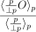
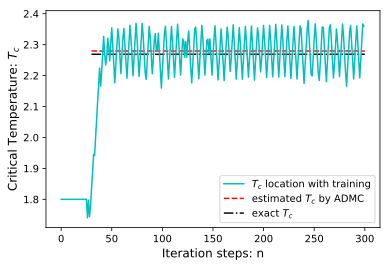
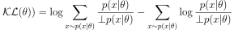
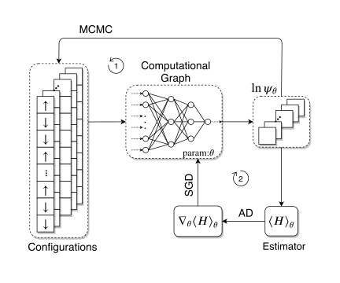
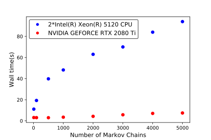

ADMC
==========

*Infinite order automatic differentiation for Monte Carlo expectations from unnormalized probability distributions.*

### Introduction

Due to the nature of Metropolis-Hasting algorithm, we can simulate the distribution by Monte Carlo as long as we have the knowledge of the ratio between probabilities (densities) for two different configurations. Namely, we can sample data from unnormalized probability distributions with unknown normalized factors of the distribution (which usually denoted as partition function in statistics physics). There are various scenarios for such MC with unormalized probability, including MCMC to estimate posteriors in Bayesian inference context and classical Monte Carlo as well as Quantum Monte Carlo methods to evaluate observable quantities from Hamiltonian models in statistical physics context.

The method to compute the derivatives of such MC expectation from unnormalized probability is lack in the literature. To utilize the power of existing ML frameworks, the only thing to hack is the object function. According to our papers, just change the object function from O to:

  

where p is the unnormalized probability (density).

And we have the following examples to show the power of this new ADMC technique.

### Examples

Note the code experiments are all implemented with TensorFlow (tested on tf1.13, cpu and gpu version) in static computational graph mode.

* Quickly locate the critical temperature for 2D Ising model

  In this example, we utilize various features that ML frameworks enable us. We implement Wolff update scheme for 2D Ising model with vectorize consideration so that tens of thounds of Markov Chains can be simulated at the same time easily. Together with GPU acceleration, automatic differentiation infrastructure and carefully designed optimizers, ML frameworks can make our life easy even beyond ML tasks.

	

* Calculate Fisher matrix for unnormalized distribution with AD approach on KL divergence

  In this example, we show six approaches to calculate Fisher matrix for a distribution (3 for normalized distributions and 3 for unnormalized distributions). The fancy AD approach to evaluate Fisher matrix is to compute KL divergence defined below in the forward pass. And the Hessian of such KL object is just Fisher matrix.

    

       
    

* End-to-end, easy-to-implement VMC with neural network wavefunctions

  Forget about all techniques and derivations for VMC in terms of its gradients or SR methods. We only need to minimize the energy, and we have no interest to derive the gradients for energy expectation by hand. Why bother when you are equipped with AD infrastructure. With moderate effort and buitin optimizer Adam, you can achieve state-of-the-art result on 2D Heisenberg model. Implementation of VMC has never been such easy as this.
  

	

	

## Reference

For details on ADMC, see our work: 